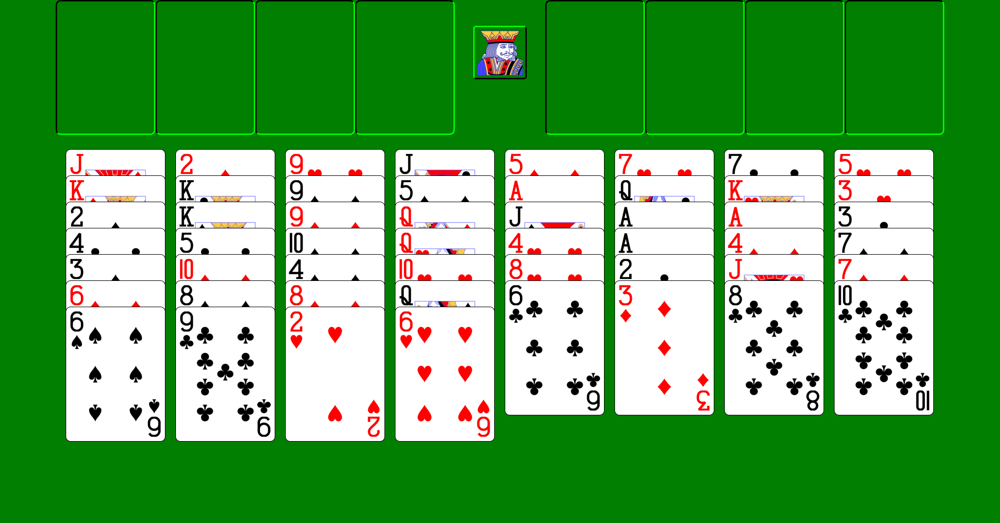

# FreeCell HD

Windows XP FreeCell, re-implemented from scratch for a freely resizable window. The cards scale
with the window and stay crisp on a 1920x1080 screen. It runs on the real thing: Windows XP SP2/SP3,
32-bit.

XP's FreeCell draws fixed 71x96-pixel cards in a window no wider than 640 pixels. FreeCell HD keeps
XP's layout, rules, menus, dialogs, keys and statistics, and scales the whole board to the window. At
1:1 (a 632x427 client area) it matches XP's geometry pixel for pixel. Maximized at 1080p the cards are
about 190x257 pixels.

*Game #1 in the client area of a maximized 1920x1080 window, rendered by `make snapshots`.*

## Download

Get `FreeCellHD.exe` from [GitHub Releases](https://github.com/ErkoRisthein/xp-cards/releases). The game
is that one 32-bit file, with no installer and no DLLs. Copy it anywhere and run it. It needs a
Pentium Pro / Pentium II, an AMD Athlon or Duron, or any later x86 CPU (it uses CMOV; SSE is not
needed). A Pentium MMX, AMD K6 or early VIA C3 cannot run it.

XP's built-in browsers can no longer open GitHub because they lack TLS 1.2. Download the file on another
computer and copy it over with a USB stick or a network share, or use `make deploy` (see below).

FreeCell HD uses XP FreeCell's own registry key for statistics and options, so your existing record
carries over, and the two programs stay in sync.

## How to play

The rules are XP's: the same deals for the same game numbers, the supermove limit of
(free cells + 1) x (empty columns + 1), the same automatic moves to the home cells, and the same
"Move to Empty Column" choice. Click a card to select it, then click where it should go.

| Input | Action |
|---|---|
| F2 | New game (a random deal from 1 to 32767, as in XP) |
| F3 | Select game: 1 to 1,000,000, or the special deals -1 and -2 |
| F4 | Statistics |
| F5 | Options: messages on illegal moves, quick play (no animation), double-click to a free cell, and the extras below |
| F10 | Undo |
| Ctrl+Y | Redo (new) |
| H | Hint (new): the card to move flashes twice, then the place it goes |
| F6 | Finish (new): send every card home, once the rest is a sure win |
| F11 or Alt+Enter | Full screen (new); Esc leaves it |
| F1 | Help. Opens XP's `freecell.chm` when it is present, otherwise a built-in summary |
| 1 to 8 | Select that column or move to it. Press it again on a selected column to show each of its cards in turn |
| 0 | Select the next free-cell card, or move the selected card to a free cell |
| 9 | Move the selected card to its home cell |
| Double-click | Send a column's bottom card to the leftmost empty free cell |
| Right button (hold) | Peek at a covered card |

XP's hidden Ctrl+Shift+F10 dialog is there too.

## What differs from XP

- The window can be resized and maximized, and the board scales with it. A column too long for the
  window is drawn with its cards closer together.
- Undo is unlimited, and Ctrl+Y redoes. Each step is one action plus its automatic moves, as in XP.
- The window size, position and maximized state are remembered between runs.
- The art is new: CC0 vector card faces rendered at high resolution, and a new king, icon and cursor.
  No Microsoft bitmaps are used.
- A few XP bugs are fixed instead of copied, for example a stale Undo after a new deal and two
  messages with missing spaces. `docs/xp-reference/rules.md` lists them.
- Game > Full Screen shows the board without a window frame (the menu bar stays).
- Select Game says when you have won a game before, and Statistics counts the different games won.

## Extras

Options > Extras has these, all off by default, so the game looks and plays like XP until you turn
them on:

- **Show time and moves** in the menu bar, next to "Cards Left".
- **Standard multi-card moves**: (free cells + 1) x 2^(empty columns) instead of XP's limit.
- **New Game picks from all 1,000,000 games** instead of XP's 1 to 32767.
- **Warn when the game can't be won**: a built-in solver checks the position in the background
  after every move and tells you, once, when the game can no longer be won, so you can undo.
- **Finish automatically**: as soon as the rest is a sure win, every card goes home.

The solver also drives two new Game menu items. **Hint** (H) shows a winning move: the card to move
flashes twice, then its destination. If the game can no longer be won, it says so. Repeated hints are
instant while you follow them. **Finish** (F6) is available once every remaining card can go home in
order, and moves them there as one move.

See [docs/ROADMAP.md](docs/ROADMAP.md) for what comes next: Solitaire, Spider and Hearts.

## Building

The exe is cross-compiled with mingw-w64 for i686. It links `msvcrt.dll` (XP has no UCRT) and
links the GCC runtime statically, so the result is a single file.

**macOS**

    brew install mingw-w64
    make                  # build/FreeCellHD.exe and build/SolitaireHD.exe (in development)
    make freecell         # build/FreeCellHD.exe only
    make release          # the same, stripped (-s), then the XP import check

Homebrew's toolchain defaults to the UCRT. The Makefile passes `-mcrtdll=msvcrt-os` (GCC 14+).

**Linux (Ubuntu 24.04)**

    sudo apt install make gcc python3 gcc-mingw-w64-i686 binutils-mingw-w64-i686
    make

Ubuntu's GCC 13 has no `-mcrtdll`, but its mingw-w64 already defaults to `msvcrt.dll`. The Makefile
detects this and leaves the option out. With a toolchain that has neither, the build fails instead of
producing an exe that XP cannot load.

**Copying to an XP machine.** `make deploy` copies the exe to a share on the XP machine over SMB1, which
macOS's own SMB client no longer supports. It needs a Python with [impacket](https://pypi.org/project/impacket/):

    python3 -m venv $HOME/.venvs/impacket && $HOME/.venvs/impacket/bin/pip install impacket
    make deploy PYTHON=$HOME/.venvs/impacket/bin/python XP_HOST=MYXPBOX XP_IP=192.168.1.50

`XP_SHARE`, `XP_DIR`, `XP_USER` and `XP_PASSWORD` are read from the environment (see `tools/deploy_smb.py`).

## Tests

    make test         # native unit tests of the engine and of the rules, controller and layout (ASan + UBSan)
    make snapshots    # render boards at several sizes to build/snapshots/*.png
    make xpcheck      # every function the exes import must exist on Windows XP SP2 and SP3
    make e2e          # end-to-end scenarios under Wine (tests/e2e/fchd_*.txt)

The game logic and the shared engine (`src/freecell`, `src/engine`, outside their `win32` directories)
are plain C with no Windows headers, so they are tested natively.
`make e2e` drives the real exe under Wine: it clicks, presses keys, answers dialogs, reads pixels and the
registry, and captures screenshots. The driver is documented in [tools/wine/README.md](tools/wine/README.md).
`make e2e` is set up for the macOS development machine. On Linux, run the smoke scenario under a virtual
display:

    xvfb-run -a -s "-screen 0 2560x1600x24" tools/ci/xvfb_wm.sh \
        tools/wine/run.sh -o build/e2e/smoke tests/e2e/fchd_smoke.txt

This needs `wine`, `wine32:i386`, `xvfb`, `openbox` and ImageMagick. `WINE`, `WINESERVER` and
`WINEPREFIX` override the defaults.

**Continuous integration.** `.github/workflows/build.yml` runs on every push and pull request on Ubuntu
24.04. It builds the stripped exes, runs `make test`, `make xpcheck` and `make snapshots`, and uploads the
exes and the snapshots as artifacts. A Wine smoke test runs as an informational job that cannot fail the
build. Pushing a tag `v*` (for example `git tag -a v1.1 -m "What's new" && git push origin v1.1`) also
publishes a GitHub Release with `FreeCellHD.exe` and `SolitaireHD.exe`. The release notes come from
`tools/ci/release-notes.md`, and an annotated tag's message becomes their "What's new" section. GitHub
disables Actions on a fork until its owner enables them on the fork's Actions tab.

## Repository layout

| Path | Contents |
|---|---|
| `src/engine` | the card-game engine shared by the games ([docs/ENGINE.md](docs/ENGINE.md)): images, card sprites, drawing, persistence, and in `win32/` the Windows pieces every game uses |
| `src/freecell` | FreeCell HD: rules, the XP game controller, statistics, the solver and the hint / finish logic, scalable layout, board renderer; `win32/` the window, menus, dialogs, registry, help |
| `src/solitaire` | Solitaire HD: rules, the XP game controller, the win cascade, scalable layout, board renderer; `win32/` the window, drag and drop, status bar, dialogs, registry, help |
| `res` | `common/`: the card art shared by the games; `freecell/`, `solitaire/`: resource scripts, king art, icon, cursor, manifests |
| `tests` | native unit tests (`engine/`, `freecell/`), the snapshot renderer, Wine end-to-end scenarios |
| `tools` | XP import checker, Wine driver, SMB deploy, asset scripts, CI helpers |
| `docs` | [design](docs/DESIGN.md), [roadmap](docs/ROADMAP.md), reverse-engineered XP reference |

The original Windows XP binaries in the repository root (`freecell.exe`, `sol.exe`, `spider.exe`,
`mshearts.exe` and `cards.dll`) come from the upstream archival repository
[esc0rtd3w/xp-cards](https://github.com/esc0rtd3w/xp-cards). They are Microsoft's, are kept here only as
the reference for the reverse engineering, and are not part of FreeCell HD.

## Credits

- Card faces: SVG playing cards by Adrian Kennard — https://cards.revk.uk (CC0)
- King busts, program icon and cursor: made for this project and dedicated to the public domain (CC0).
  The king is derived from the CC0 King of Spades above. Details are in [res/LICENSE-ART.md](res/LICENSE-ART.md).
- [stb_image](https://github.com/nothings/stb) by Sean Barrett (public domain, or MIT)

## Disclaimer

FreeCell HD is an independent re-implementation. It is not affiliated with or endorsed by Microsoft.
FreeCell was created by Jim Horne at Microsoft, after Paul Alfille's 1978 game for the PLATO system.
Windows and Windows XP are trademarks of Microsoft Corporation.
